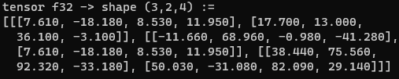
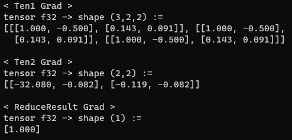

# grazie (`grad-c`)
A simple, bare-bones, single-threaded, CPU-based (for now) tensor and autograd library I'm building in my spare. The code is pure C without the use of any libararies (except for C-runtime).

The goal of the project is not to build a competitor to any neural network frameworks, but rather an excercise to learn the fundamentals of mathematics that goes into tensor operations used for training neural networks.
As a result, no emphasis has been put into optimization (although that is something I wish to come back to)

## Current Status
At the moment, the project has the most fundamental tensor operations implemented, with certain omissions. The tensors operation currently supported are:
- Addition
- Subtraction
- Multiplication
- Division
- Broadcasting Semantics
- Matrix Multiplication
- Transpose (Arbitrary Dimensions)

More importantly, every tensor operation (with the current exception of Traspose and MatMul) has a corresponding backward implements which generates the Jacobian of the tensor for backpropagation.

#### The current short-term focus of the project is to:
- Implement backward operation for MatMul
- Train an XOR classifier as a test 
- Train an MNIST classifier (Unless we are making our own image library, it is best to use `stb_image` for this)

#### Some of the long-term goals are:
- Implement CUDA versions of each operation (My GPU yerbn.
- Re-implement all operation using vectorized SIMD instructions.
- Introduce multi-threading at some point (mutexes will be fun -_-)

## Examples
#### Tensor Multiplication with broadcasting
```C
#include "grazie.h"

int main() {
    tensor32 *Ten1 = TensorFromArrayLiteral(Ten1, float32,
                                            ARR(2, 2, 2), 
                                            ARR(-2.4f,   1.43f,
                                                 5.8f,   1.7f,
                                                12.14f, -3.4f,
                                                2.43f,   6.8f), true);
    tensor32 *Ten2 = TensorFromArrayLiteral(Ten2, float32,
                                            ARR(2, 2),
                                            ARR(1, -2, 
                                                3, 5,), true); 
    uint32 RShape[] = {2, 2, 2};
    tensor32 *Result = T32Empty(RShape, float32, true);

    T32Mul(Ten1, Ten2, Result);

    // NOTE(Abid): Print the Result tensor
    PrintTensor32(Result);

    return(0);
}
```
Result:


#### Matrix Multiplication
```C
#include "grazie.h"

int main() {
    tensor32 *Ten1 = TensorFromArrayLiteral(Ten1, float32,
                                            ARR(3, 2, 2), // Shape
                                            ARR(-2.4f, 1.43f,
                                                 5.8f,  1.7f,
                                                12.14f, -3.4f,
                                                -2.4f, 1.43f,
                                                22.34f,  2.3f,
                                                2.43f, 6.8f), true);
    tensor32 *Ten2 = TensorFromArrayLiteral(Ten2, float32,
                                            ARR(2, 4),
                                            ARR(1, 4, 3, -2,
                                                7, -6, 11, 5,), true);
    uint32 RShape[] = {3, 2, 4};
    tensor32 *Result = T32Empty(RShape, float32, true);

    T32MatMul(Ten1, Ten2, Result);
    PrintTensor32(Result);

    return(0);
}
```
Result:



#### Gradient Calculationa and Backpropagation
```C
#include "grazie.h"

int main() {
    tensor32 *Ten1 = TensorFromArrayLiteral(Ten1, float32,
                                            ARR(3, 2, 2),
                                            ARR(-2.4f, 1.43f,
                                                 5.8f,  1.7f,
                                                12.14f, -3.4f,
                                                -2.4f, 1.43f,
                                                22.34f,  2.3f,
                                                2.43f, 6.8f), true);
    tensor32 *Ten2 = TensorFromArrayLiteral(Ten2, float32,
                                            ARR(2, 4),
                                            ARR(1, 4, 3, -2,
                                                7, -6, 11, 5,), true);

    uint32 RShape[] = {3, 2, 2};
    tensor32 *Result = T32Empty(RShape, float32, true);
    uint32 ReShape[] = {1};
    tensor32 *ReduceResult = T32Empty(ReShape, float32, true);

    T32Div(Ten1, Ten2, Result);
    T32ReduceSumAll(Result, ReduceResult);

    // NOTE(Abid): Backpropagation
    Backward(ReduceResult, true);

    SwapDataGrad(Ten1);
    SwapDataGrad(Ten2);
    SwapDataGrad(ReduceResult);
        printf("< Ten1 Grad >\n");
        PrintTensor32(Ten1);
        printf("< Ten2 Grad >\n");
        PrintTensor32(Ten2);
        printf("< ReduceResult Grad >\n");
        PrintTensor32(ReduceResult);
    SwapDataGrad(Ten1);
    SwapDataGrad(Ten2);
    SwapDataGrad(ReduceResult);

    return(0)
}
```
Result:


