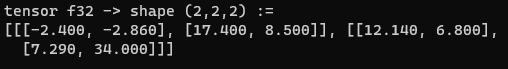

# grazie (`grad-c`)
A simple, bare-bones, CPU-based (for now) tensor and autograd library I'm building in my spare time. The code is pure C without the use of any libararies (except for C-runtime).

The goal of the project is not to build a competitor to any neural network frameworks, but rather an excercise to learn the fundamentals of mathematics that goes into tensor operations used for training neural networks, while also creating a minimalist deep learning toolset with efficiency at its core.
That means there will be NO memory allocation during training of inference, and NO arbitracy "convenient" kernel implemented.

## Current Status
At the moment, the project has the most fundamental tensor operations implemented, as well as a version of reverse-mode automatic differentiation and backpropagation.


#### The current short-term focus of the project is to:
- Train an XOR classifier as a test 
- Train an MNIST classifier (Unless we are making our own image library, it is best to use `stb_image` for this)

#### Some of the long-term goals are:
- Implement CUDA versions of each operation (My GPU yearns).
- Re-implement all operation using vectorized SIMD instructions.
- Introduce multi-threading at some point (mutexes will be fun -_-)

## Examples
#### Sample Training of a Linear Module with Arena-based memory management
```C
#include "grazie.h"

i32 main() {
    mem_arena MainArena = AllocateArena(Megabyte(100));

    u32 InputShape[] = {5, 7};
    f32 InputData[] = {
        0.3978f, -1.1573f,  0.5564f,  1.4209f,  0.6619f,  1.2710f,  1.0088f,
        0.6431f, -0.7379f, -0.2102f, -0.1002f, -2.2516f, -1.1144f, -1.2046f,
        0.5182f, -0.7396f,  0.1325f,  2.8119f, -0.2471f, -0.2388f,  1.0221f,
        0.2247f, -0.0725f,  0.6489f,  0.6703f, -2.3605f, -0.9891f,  0.3283f,
       -0.2900f,  0.9854f,  0.7036f,  0.4051f, -0.2086f, -0.7467f, -0.5946f
    };
    t32 *Input = T32Data(InputShape, InputData, f32, true, &MainArena);

    /* NOTE(Abid): Model definition */
    module *Lin1 = T32Linear(7, 6, &MainArena);
    tensor_list OptimList = T32AllocateTensorList(1024, &MainArena);
    /* NOTE(Abid): Temporary measure */
    __T32AddToTensorList(&OptimList, Lin1->TensorList.Array[0]);
    __T32AddToTensorList(&OptimList, Lin1->TensorList.Array[1]);

    /* NOTE(Abid): Training loop */
    for(u32 Idx = 0; Idx < 10; ++Idx) {
        temp_memory TempSession = BeginTempMemory(&MainArena);

        T32ZeroGrad(OptimList);
        t32 *Output = RunModule(Lin1, Input, &MainArena);
        u32 LossShape[] = {1};
        t32 *Loss = T32Empty(LossShape, f32, true, &MainArena);
        T32ReduceSumAll(Output, Loss);

        T32Backprop(Loss);
        T32SGDOptim(OptimList, 0.1f);

        EndTempMemory(TempSession);
    }
    T32Print(Lin1->TensorList.Array[0]);
    T32Print(Lin1->TensorList.Array[1]);

    return(0);
}
```
#### Backpropagation of a Matrix Multiplication with Broadcast Support
```C
#include "grazie.h"

int main() {
    tensor32 *Ten1 = TensorFromArrayLiteral(Ten1, float32, ARR(2, 3, 2),
                                            ARR(-2.4f, 1.43f,
                                                 5.8f,  1.7f,
                                                12.14f, 0.4f,

                                                -3.55f, 14.73f,
                                                22.34f,  2.3f,
                                                2.43f, 6.8f), true);

    tensor32 *Ten2 = TensorFromArrayLiteral(Ten2, float32, ARR(2, 4),
                                            ARR(2.2f, 4.76f, 3.01f, -2.93f,
                                                7.45f, -6.11f, 11.08f, 5.3f), true);


    uint32 RShape[] = {2, 3, 4};
    tensor32 *Result = T32Empty(RShape, float32, true);
    uint32 ReShape[] = {1};
    tensor32 *ReduceResult = T32Empty(ReShape, float32, true);

    T32MatMul(Ten1, Ten2, Result);
    T32ReduceSumAll(Result, ReduceResult);

    __BackwardT32SetElements(Ten1, 0.f);
    __BackwardT32SetElements(Ten2, 0.f);
    __BackwardT32SetElements(Result, 0.f);
    __BackwardT32SetElements(ReduceResult, 0.f);

    Backward(ReduceResult);

    SwapDataGrad(Ten1);
    SwapDataGrad(Ten2);
    SwapDataGrad(ReduceResult);
        printf("< Ten1 Grad >\n");
        PrintTensor32(Ten1);
        printf("< Ten2 Grad >\n");
        PrintTensor32(Ten2);
        printf("< ReduceResult Grad >\n");
        PrintTensor32(ReduceResult);
    SwapDataGrad(Ten1);
    SwapDataGrad(Ten2);
    SwapDataGrad(ReduceResult);

    return(0);
}
```
Result:


#### Tensor Multiplication with Broadcasting
```C
#include "grazie.h"

int main() {
    tensor32 *Ten1 = TensorFromArrayLiteral(Ten1, float32,
                                            ARR(2, 2, 2), 
                                            ARR(-2.4f,   1.43f,
                                                 5.8f,   1.7f,
                                                12.14f, -3.4f,
                                                2.43f,   6.8f), true);
    tensor32 *Ten2 = TensorFromArrayLiteral(Ten2, float32,
                                            ARR(2, 2),
                                            ARR(1, -2, 
                                                3, 5,), true); 
    uint32 RShape[] = {2, 2, 2};
    tensor32 *Result = T32Empty(RShape, float32, true);

    T32Mul(Ten1, Ten2, Result);

    // NOTE(Abid): Print the Result tensor
    PrintTensor32(Result);

    return(0);
}
```
Result:



#### Matrix Multiplication
```C
#include "grazie.h"

int main() {
    tensor32 *Ten1 = TensorFromArrayLiteral(Ten1, float32,
                                            ARR(3, 2, 2), // Shape
                                            ARR(-2.4f, 1.43f,
                                                 5.8f,  1.7f,
                                                12.14f, -3.4f,
                                                -2.4f, 1.43f,
                                                22.34f,  2.3f,
                                                2.43f, 6.8f), true);
    tensor32 *Ten2 = TensorFromArrayLiteral(Ten2, float32,
                                            ARR(2, 4),
                                            ARR(1, 4, 3, -2,
                                                7, -6, 11, 5,), true);
    uint32 RShape[] = {3, 2, 4};
    tensor32 *Result = T32Empty(RShape, float32, true);

    T32MatMul(Ten1, Ten2, Result);
    PrintTensor32(Result);

    return(0);
}
```
Result:


#### Gradient Calculation and Backpropagation
```C
#include "grazie.h"

int main() {
    tensor32 *Ten1 = TensorFromArrayLiteral(Ten1, float32,
                                            ARR(3, 2, 2),
                                            ARR(-2.4f, 1.43f,
                                                 5.8f,  1.7f,
                                                12.14f, -3.4f,
                                                -2.4f, 1.43f,
                                                22.34f,  2.3f,
                                                2.43f, 6.8f), true);
    tensor32 *Ten2 = TensorFromArrayLiteral(Ten2, float32,
                                            ARR(2, 4),
                                            ARR(1, 4, 3, -2,
                                                7, -6, 11, 5,), true);

    uint32 RShape[] = {3, 2, 2};
    tensor32 *Result = T32Empty(RShape, float32, true);
    uint32 ReShape[] = {1};
    tensor32 *ReduceResult = T32Empty(ReShape, float32, true);

    T32Div(Ten1, Ten2, Result);
    T32ReduceSumAll(Result, ReduceResult);

    // NOTE(Abid): Backpropagation
    Backward(ReduceResult, true);

    SwapDataGrad(Ten1);
    SwapDataGrad(Ten2);
    SwapDataGrad(ReduceResult);
        printf("< Ten1 Grad >\n");
        PrintTensor32(Ten1);
        printf("< Ten2 Grad >\n");
        PrintTensor32(Ten2);
        printf("< ReduceResult Grad >\n");
        PrintTensor32(ReduceResult);
    SwapDataGrad(Ten1);
    SwapDataGrad(Ten2);
    SwapDataGrad(ReduceResult);

    return(0)
}
```
Result:


